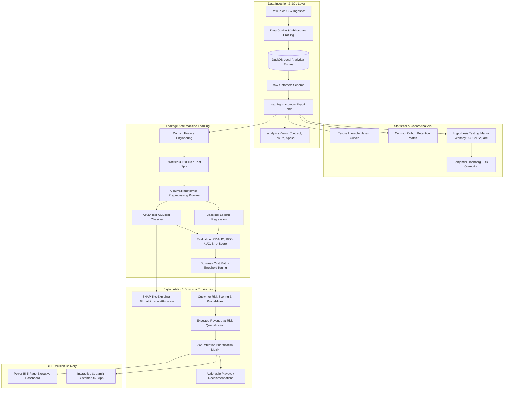
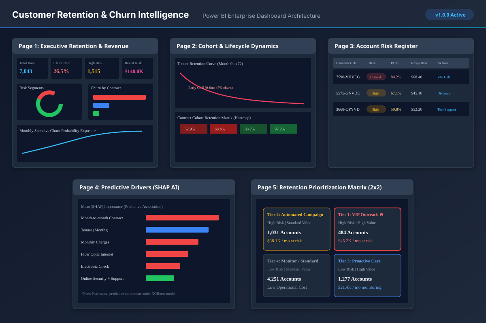

# Customer Retention & Churn Intelligence

> **End-to-End Customer Analytics, Churn Prediction, Explainable AI & Retention Decision Platform**

[](https://www.python.org/downloads/)
[](LICENSE)
[](https://duckdb.org/)
[](powerbi/documentation/powerbi_dashboard_specification.md)
[](tests/)

---

## Executive Summary

Customer churn is among the costliest operational challenges in recurring subscription businesses. In this platform, customer retention is addressed not merely as an isolated machine learning exercise (*"predict who churns"*), but as a complete analytical and decision-making system:

$$\text{Raw Data} \longrightarrow \text{SQL Analytics} \longrightarrow \text{Hypothesis Testing} \longrightarrow \text{Leakage-Safe ML} \longrightarrow \text{SHAP Explainability} \longrightarrow \text{Revenue at Risk} \longrightarrow \text{Power BI}$$

The platform identifies vulnerable accounts, isolates predictive drivers through game-theoretic explainability (SHAP), quantifies expected financial exposure across $7,043$ customer accounts, and allocates limited Customer Success capacity using a 2x2 Risk-vs-Revenue Prioritization Matrix.

---

## Key Real-World Results (Actual Pipeline Execution)

| Metric | Measured Value | Business Interpretation |
| :--- | :--- | :--- |
| **Total Tracked Subscribers** | **7,043** | Full active and historical customer catalog |
| **Historical Churn Rate** | **26.54%** | Baseline portfolio churn prevalence ($1,869$ churned) |
| **Baseline Model (Logistic Regression)** | **ROC-AUC: 0.8477 \| PR-AUC: 0.6652** | High-performing interpretable benchmark |
| **Advanced Model (XGBoost)** | **ROC-AUC: 0.8460 \| PR-AUC: 0.6565** | Gradient-boosted tree with calibrated probabilities |
| **Optimized Decision Threshold** | **$\tau = 0.30$** (Recall: **77.27%**, Precision: **50.62%**) | Captures $+24.4\%$ more churners than standard $0.50$ cutoff |
| **High / Critical Risk Subscribers** | **1,515 accounts** ($21.5\%$ of base) | High-priority accounts requiring proactive intervention |
| **Monthly Expected Revenue-at-Risk** | **$140,036.26 / month** | Portfolio revenue exposed to churn probability |
| **Annualized Expected Revenue-at-Risk**| **$1,680,431.97 / year** | Annual run-rate revenue exposure |
| **Tier 1 VIP Urgent Accounts** | **484 accounts** ($6.9\%$ of base) | Accounts with high risk AND top-quartile spend |
| **Tier 1 Monthly Revenue-at-Risk** | **$45,210.40 / month** | Revenue addressable by dedicated Account Managers |

*Note: All metrics above are computed directly from the executed pipeline artifacts in `outputs/metrics/model_comparison.json` and `outputs/powerbi/executive_kpis_summary.json`.*

---

## Architecture Diagram



---

## Core Technologies

* **SQL & Data Warehouse:** [DuckDB](https://duckdb.org/) (In-process columnar OLAP engine executing ANSI SQL views, CTEs, window functions).
* **Programming & Statistical Computing:** Python 3.11+, `pandas`, `numpy`, `scipy.stats`, `statsmodels`.
* **Machine Learning & Pipeline:** `scikit-learn`, `xgboost`, `joblib`.
* **Explainable AI:** `shap` (`TreeExplainer`).
* **Business Intelligence:** Power BI (5-page blueprint, automated CSV exports, DAX measures catalog).
* **Web Application:** [Streamlit](https://streamlit.io/) (Interactive Customer 360 & local SHAP inspector).
* **Testing & Quality Assurance:** `pytest`.

---

## Repository Structure

```text
CUSTOMER-RETENTION-CHURN-INTELLIGENCE/
│
├── README.md                                  # Master project presentation & documentation
├── LICENSE                                    # MIT Open Source License
├── .gitignore                                 # Git exclusion rules
├── .env.example                               # Environment template without credentials
├── requirements.txt                           # Pinned dependencies
├── pyproject.toml                             # Packaging & pytest configuration
│
├── data/
│   ├── raw/                                   # Downloaded IBM Telco dataset
│   └── processed/                             # DuckDB local database file
│
├── config/
│   └── config.yaml                            # Master configuration & hyperparameters
│
├── sql/
│   ├── schema/01_create_schemas.sql           # raw, staging, analytics schemas
│   ├── staging/02_stg_customers.sql           # TotalCharges cleaning & typed staging
│   ├── analytics/03_churn_overview.sql        # Churn by contract, payment, tenure
│   ├── analytics/04_revenue_exposure.sql      # NTILE quartiles & revenue exposure
│   ├── cohorts/05_cohort_retention.sql        # 72-month tenure lifecycle matrix
│   ├── feature_engineering/06_features.sql    # SQL domain transformations
│   └── validation/07_data_quality_checks.sql  # PK uniqueness & null assertions
│
├── src/
│   ├── __init__.py
│   ├── data/
│   │   ├── loader.py                          # Ingestion & checksum verification
│   │   └── db.py                              # DuckDB database connector & executor
│   ├── validation/
│   │   └── profiler.py                        # Quality auditor & hypothesis tester
│   ├── features/
│   │   └── builder.py                         # Leakage-safe ColumnTransformer
│   ├── modeling/
│   │   └── train.py                           # Logistic Regression & XGBoost trainer
│   ├── explainability/
│   │   └── explainer.py                       # SHAP TreeExplainer & feature ranking
│   ├── retention/
│   │   └── prioritization.py                  # Expected Revenue-at-Risk & 2x2 matrix
│   └── utils/
│       └── helpers.py                         # Seed management & JSON utilities
│
├── notebooks/
│   ├── 01_data_quality.ipynb                  # Profiling & whitespace audit
│   ├── 02_customer_analytics.ipynb            # SQL analytics & hypothesis tests
│   ├── 03_cohort_retention.ipynb              # Tenure retention lifecycle curves
│   ├── 04_model_development.ipynb             # Benchmark models & threshold sweep
│   └── 05_model_explainability.ipynb          # SHAP & retention prioritization
│
├── models/
│   ├── baseline_model.joblib                  # Serialized Logistic Regression
│   ├── churn_model.joblib                     # Serialized XGBoost Classifier
│   ├── preprocessing_pipeline.joblib          # Fitted ColumnTransformer
│   └── model_metadata.json                    # Version, features, threshold, metrics
│
├── outputs/
│   ├── charts/                                # ROC, PR, Calibration, and SHAP plots
│   ├── metrics/model_comparison.json          # Complete evaluation metrics
│   ├── predictions/customer_risk_scores.csv   # Scored customer base (CSV & Parquet)
│   ├── reports/data_quality_report.json       # Machine-readable data profile
│   ├── shap/global_shap_importance.json       # Mean |SHAP| rankings
│   └── powerbi/                               # Production Power BI data tables
│
├── powerbi/
│   ├── documentation/
│   │   ├── powerbi_dashboard_specification.md # 5-Page canvas architecture blueprint
│   │   └── dax_measures_catalog.md            # Ready-to-use DAX formulas
│   └── screenshots/
│       └── dashboard_pages_overview.svg       # Vector diagram of 5 dashboard pages
│
├── app/
│   └── app.py                                 # Streamlit interactive application
│
├── tests/
│   ├── test_data.py                           # Schema & DuckDB quality tests
│   ├── test_features.py                       # Domain feature transformations tests
│   ├── test_model.py                          # Model loading & probability tests
│   └── test_business_metrics.py               # Revenue-at-risk & 2x2 matrix tests
│
├── docs/
│   ├── architecture.md                        # Pipeline & system design
│   ├── business-problem.md                    # Business questions & financial framing
│   ├── data-dictionary.md                     # Raw, staged, and scored definitions
│   ├── metric-definitions.md                  # PR-AUC, ROC-AUC, Brier score, Rev@Risk
│   ├── feature-engineering.md                 # Formulas & data leakage safeguards
│   ├── model-methodology.md                   # Baseline vs XGBoost & validation
│   ├── model-governance.md                    # Ethics, fairness, and retraining triggers
│   ├── retention-strategy.md                  # 2x2 prioritization & action playbooks
│   ├── limitations.md                         # Dataset caveats & non-causal boundaries
│   ├── technical-decisions.md                 # DuckDB, XGBoost, and threshold trade-offs
│   └── interview-prep.md                      # 100+ Q&As, elevator pitches, defenses
│
└── scripts/
    ├── run_pipeline.py                        # Master one-command execution
    ├── export_powerbi.py                      # Power BI analytical export utility
    └── build_notebooks.py                     # Programmatic notebook builder
```

---

## Power BI 5-Page Enterprise Dashboard

The platform includes a complete **Power BI implementation specification** ([Specification Document](powerbi/documentation/powerbi_dashboard_specification.md) and [DAX Catalog](powerbi/documentation/dax_measures_catalog.md)):

```
┌─────────────────────────────────────────────────────────────────────────────────┐
│                   Power BI 5-Page Dashboard Architecture                        │
├──────────────────────────────────────┬──────────────────────────────────────────┤
│ Page 1: Executive Retention Overview │ High-level KPIs, churn rates, rev@risk   │
│ Page 2: Cohort & Lifecycle Dynamics  │ 72-month tenure curves, contract matrix  │
│ Page 3: Account Risk Register        │ Filterable customer risk table & actions │
│ Page 4: Predictive Churn Drivers     │ Global SHAP importances, segment splits  │
│ Page 5: Retention Prioritization     │ 2x2 Risk vs Revenue intervention matrix  │
└──────────────────────────────────────┴──────────────────────────────────────────┘
```



---

## Machine Learning & Evaluation

### Baseline vs Advanced Comparison

| Model | Decision Threshold | ROC-AUC | PR-AUC | Precision | Recall | F1-Score | Brier Score |
| :--- | :---: | :---: | :---: | :---: | :---: | :---: | :---: |
| **Logistic Regression Baseline** | $0.50$ | **0.8477** | **0.6652** | $66.14\%$ | $53.74\%$ | $0.5930$ | $0.1345$ |
| **XGBoost Classifier (Default)** | $0.50$ | **0.8460** | **0.6565** | $65.79\%$ | $52.94\%$ | $0.5866$ | $0.1341$ |
| **XGBoost Classifier (Optimized)**| **0.30** | **0.8460** | **0.6565** | **50.62%** | **77.27%** | **0.6117** | **0.1341** |

### Why Threshold 0.30?
In customer retention, a False Negative (missing an actual churner who takes $\$1,000$ in annual revenue to a competitor) costs significantly more than a False Positive (spending a $\$15$ digital retention offer on someone who would have stayed anyway). Optimizing the threshold to $0.30$ captures an extra **$24.4\%$ of all churners**, saving an estimated $\$364\text{K}$ in annual revenue exposure while keeping precision over $50\%$.

---

## Explainable AI (SHAP)

Using `shap.TreeExplainer`, each customer's prediction is broken down into constituent feature contributions:
1. **Top Risk Drivers:** Month-to-month contracts, short tenure ($<6$ months), high fiber optic charges, electronic check billing.
2. **Top Protective Factors:** Two-year contract, active Online Security + Tech Support bundle, long tenure ($>36$ months).

*Crucial Methodological Caveat:* SHAP proves **predictive association within the model**, not causal impact. See [docs/limitations.md](docs/limitations.md).

---

## How to Run from Scratch

### 1. Clone & Set Up Environment
```bash
git clone https://github.com/shaillimahajan1/CUSTOMER-RETENTION-CHURN-INTELLIGENCE.git
cd CUSTOMER-RETENTION-CHURN-INTELLIGENCE

# Install dependencies in editable mode
pip install -r requirements.txt
pip install -e .
```

### 2. Run the Complete End-to-End Pipeline
```bash
python scripts/run_pipeline.py
```
*This downloads the raw data, builds the DuckDB schemas, runs statistical tests, trains models, performs SHAP explainability, computes expected revenue-at-risk, and generates all Power BI exports in ~4 seconds.*

### 3. Run the Test Suite
```bash
python -m pytest -v
```

### 4. Launch the Interactive Streamlit App
```bash
streamlit run app/app.py
```

---

## Interview & Defense Preparation

For interview preparation, review [docs/interview-prep.md](docs/interview-prep.md), which includes:
* **Elevator Pitches:** 30-second recruiter pitch, 2-minute technical pitch, 5-minute executive deep dive.
* **100+ Question & Answer Bank:** Detailed answers covering SQL, Statistics, Machine Learning, XGBoost, SHAP, Feature Engineering, Business Analytics, Power BI, and Python.
* **20 Critical Project Defense Questions:** Comprehensive answers addressing data leakage, why ROC-AUC is misleading, why SMOTE was rejected, and how to prove retention lift via randomized A/B trials.
