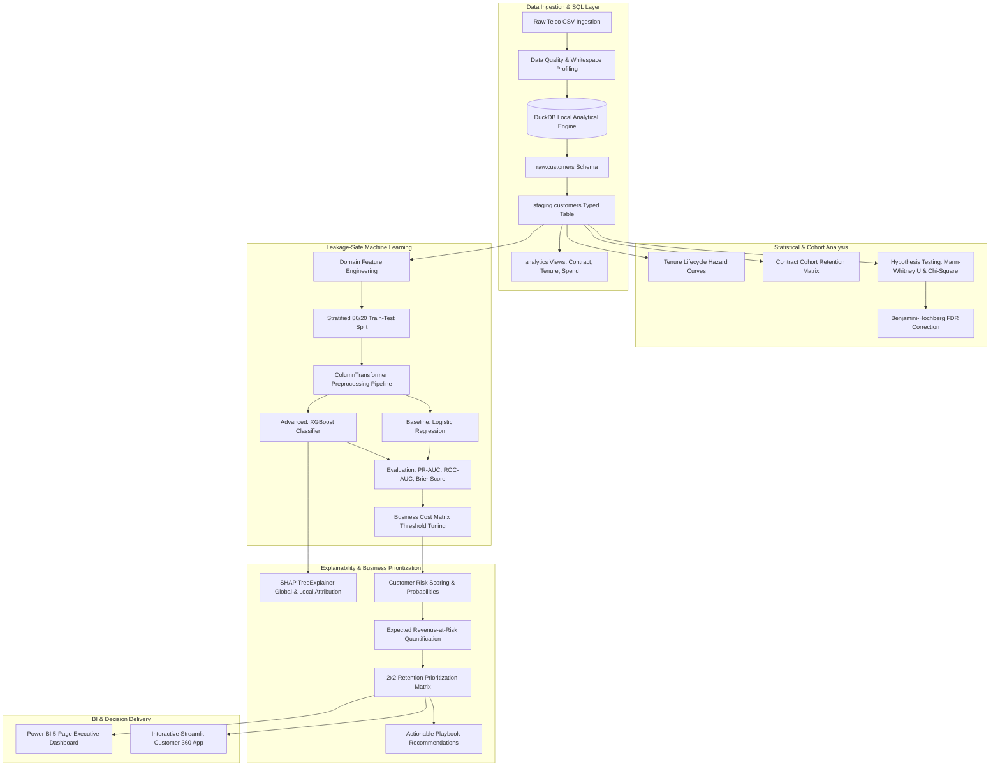

# Project Architecture & System Design

## 1. Overview
The **Customer Retention & Churn Intelligence Platform** bridges modern analytics engineering, leakage-safe machine learning, explainable AI (SHAP), and business decision support.

The system processes raw subscription and customer transaction records, enforces quality assertions through an analytical DuckDB SQL layer, computes cohort dynamics and statistical tests, trains calibrated classification models, explains predictive attributions via SHAP, and translates predictions into an expected Revenue-at-Risk matrix and Power BI executive dashboards.

---

## 2. End-to-End Data Pipeline Architecture

---

## 3. Component Breakdown

| Layer | Technology | Primary Function | Outputs |
| :--- | :--- | :--- | :--- |
| **Ingestion** | Python (`urllib`, `pandas`) | Automated fetch from canonical source with checksum and schema verification | `data/raw/Telco-Customer-Churn.csv` |
| **Database** | DuckDB (In-Process SQL OLAP) | Strict typing, TotalCharges normalization, analytical cohort aggregations, quality assertions | `data/processed/customer_retention.duckdb` |
| **Data Quality & Stats** | `scipy.stats`, `statsmodels` | Null checks, outlier detection, Mann-Whitney U, Chi-Square, Benjamini-Hochberg FDR | `outputs/reports/data_quality_report.json`, `outputs/reports/statistical_tests.json` |
| **Feature Engineering** | `scikit-learn`, `numpy` | Leakage-safe domain feature creation (add-ons, billing stability ratio, vulnerability interactions) | Preprocessor transformer, clean training splits |
| **Modeling** | `sklearn`, `xgboost`, `joblib` | Logistic Regression baseline vs XGBoost, PR-AUC optimization, cost-matrix threshold tuning | `models/churn_model.joblib`, `models/model_metadata.json` |
| **Explainability** | `shap` | TreeExplainer global feature importance and individual customer waterfall explanations | `outputs/shap/global_shap_importance.json`, `outputs/charts/shap_summary_plot.png` |
| **Decision Science** | Python | Expected Revenue-at-Risk ($P(churn) \times Revenue$), 2x2 priority matrix, automated action playbooks | `outputs/predictions/customer_risk_scores.csv` |
| **Business Intelligence** | Power BI | 5-page enterprise dashboard (Executive KPIs, Cohorts, Risk Register, Drivers, Prioritization) | `outputs/powerbi/powerbi_customer_retention_dataset.csv`, DAX catalogs |
| **Interactive App** | Streamlit | Fast customer 360 lookup, real-time SHAP force plots, simulation sliders | `app/app.py` |

---

## 4. Key Design Decisions

1. **DuckDB as Local Analytical Engine:**
   - Provides serverless, fast columnar execution for complex window functions (`PERCENT_RANK`, `NTILE`, rolling sums) without requiring the user or CI to configure an external PostgreSQL server.
   - Code is written in standard ANSI SQL compatible with PostgreSQL or Snowflake.
2. **Leakage-Safe Preprocessor Separation:**
   - Scalers and encoders are strictly fitted on the 80% training set (`X_train`) and only transform `X_test` and production records.
   - No target information or post-event behavioral metrics are used.
3. **Probabilistic Decision Science:**
   - Binary predictions are decoupled from the arbitrary 0.50 threshold. The system defaults to an optimized 0.30 decision threshold selected to maximize F1 and minimize business intervention costs on the Precision-Recall curve.
