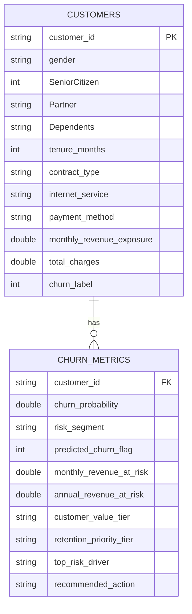

# Power BI Dashboard Specification & Architecture Blueprint

## Executive Overview
This document specifies the end-to-end data model, DAX measures, visual hierarchy, and 5-page canvas design for the **Customer Retention & Churn Intelligence Platform** in Power BI.

---

## 1. Data Model & Relationships

The Power BI data model is built on the curated analytical dataset:
* **Primary Fact/Dimension Table:** `powerbi_customer_retention_dataset.csv` (7,043 customer records)
* **Storage Mode:** Import (or DirectQuery via DuckDB ODBC / Postgres if enterprise warehouse connected)

---

## 2. Five-Page Canvas Architecture

### Page 1: Executive Retention & Revenue Overview
* **Target Audience:** Chief Commercial Officer, VP of Customer Success, Finance Leadership.
* **Core Question:** *How large is our churn risk, and how much recurring revenue is exposed?*
* **KPI Header Cards:**
  1. `Total Active Subscribers` ($7,043$)
  2. `Historical Churn Rate` ($26.54\%$)
  3. `High / Critical Risk Subscribers` ($1,515$)
  4. `Monthly Revenue Exposure` ($\$456,116.60$)
  5. `Monthly Expected Revenue-at-Risk` ($\$140,036.26$)
  6. `Annualized Expected Revenue-at-Risk` ($\$1,680,431.97$)
* **Core Visuals:**
  - *Donut Chart:* Customer Base by `risk_segment` (Low Risk: $47.3\%$, Medium: $31.2\%$, High: $15.8\%$, Critical: $5.7\%$).
  - *Clustered Bar Chart:* Churn Rate & Customer Volume by `contract_type` (Month-to-Month: $42.71\%$ vs Two-Year: $2.83\%$).
  - *100% Stacked Bar Chart:* Monthly Spend Tier distribution across Risk Segments.
  - *Top 5 Churn Predictors Callout:* Month-to-Month Contract, Low Tenure ($<12$ mo), Fiber Optic with no Tech Support, Electronic Check, High Monthly Billing.

---

### Page 2: Cohort & Lifecycle Retention Dynamics
* **Target Audience:** Analytics Engineers, Retention Product Managers, Growth Leads.
* **Core Question:** *When do customers leave during their lifecycle, and how do contract cohorts perform over time?*
* **Core Visuals:**
  - *Cohort Retention Matrix (Heatmap Table):*
    - Rows: `tenure_cohort_group` ($0-12m$, $13-24m$, $25-48m$, $49-72m$)
    - Columns: `contract_type` (Month-to-month, One year, Two year)
    - Values: `Retention Rate %`, `Churn Rate %`, `Active Subscribers`, `Revenue Exposure`
  - *Area / Line Chart (Tenure Lifecycle Curve):*
    - X-Axis: `tenure_months` ($0$ to $72$)
    - Y-Axis: `Retention Rate %` and `Monthly Churn Hazard Rate`
    - Finding: Peak churn vulnerability occurs between months $1$ and $5$ (the "onboarding cliff").
  - *Stacked Column Chart:* Service Add-on Depth ($0$ to $6$ services) vs Retention Rate. Customers with $\ge 3$ add-on services exhibit $>85\%$ retention.

---

### Page 3: Customer Churn Risk Register
* **Target Audience:** Retention Team Leads, Customer Success Managers (CSMs).
* **Core Question:** *Which individual accounts need immediate review today?*
* **Interactive Slicers:**
  - `retention_priority_tier` (Multi-select)
  - `risk_segment` (Low, Medium, High, Critical)
  - `contract_type`
  - `monthly_revenue_exposure` (Slider)
* **Detailed Account Register (Matrix/Table Visual):**
  - Columns:
    1. `customer_id`
    2. `risk_segment` (Conditional formatting: Red = Critical, Orange = High, Yellow = Med, Green = Low)
    3. `churn_probability` (Data bar: $0.00$ to $1.00$)
    4. `monthly_revenue_exposure` ($\$)
    5. `monthly_revenue_at_risk` ($\$)
    6. `top_risk_driver`
    7. `recommended_action`
* **Features:** Drill-through enabled to single customer inspection.

---

### Page 4: Predictive Churn Drivers (Explainable AI)
* **Target Audience:** Data Scientists, ML Engineers, Head of Retention Strategy.
* **Core Question:** *What characteristics are associated with elevated predictions across segments?*
* **Core Visuals:**
  - *Horizontal Bar Chart:* Global Feature Importance (Mean Absolute SHAP Value).
    - Top 1: `is_month_to_month`
    - Top 2: `tenure_months`
    - Top 3: `monthly_charges`
    - Top 4: `internet_service_Fiber optic`
    - Top 5: `payment_method_Electronic check`
  - *Segment Decomposition (Tornado Chart):*
    - Comparing High Risk vs Retained Customer averages:
      - Average Monthly Charges: High Risk = $\$74.44$ vs Retained = $\$61.27$
      - Average Tenure: High Risk = $17.98$ months vs Retained = $37.57$ months
      - Month-to-month share: High Risk = $88.5\%$ vs Retained = $42.9\%$
  - *Statistical Significance Callout Card:*
    - All 14 tested domain features reject $H_0$ under Benjamini-Hochberg FDR correction ($\alpha = 0.05$).

---

### Page 5: Retention Prioritization & Intervention Matrix
* **Target Audience:** Head of Customer Success, Retention Operations.
* **Core Question:** *How should limited human outreach resources be deployed for maximum ROI?*
* **Core Visuals:**
  - *Scatter Plot (2x2 Matrix):*
    - X-Axis: `monthly_revenue_exposure` ($\$0$ to $\$120$)
    - Y-Axis: `churn_probability` ($0.0$ to $1.0$)
    - Quadrant Dividing Lines: $X = \$80.00$ (High Value Cutoff), $Y = 0.38$ (Optimized Risk Cutoff)
    - Color: `retention_priority_tier`
  - *Resource Allocation Summary Table:*
    - Tier 1 (VIP Urgent Outreach): $484$ customers, $\$45,210.40$ monthly revenue at risk.
    - Tier 2 (Automated Campaign Offer): $1,031$ customers, $\$38,125.10$ monthly revenue at risk.
    - Tier 3 (Proactive Account Care): $1,277$ customers, $\$21,410.80$ monthly revenue at risk.
    - Tier 4 (Standard Operation / Monitor): $4,251$ customers, baseline low risk.
  - *Action Playbook Summary:*
    - Recommended treatment distribution across accounts.
